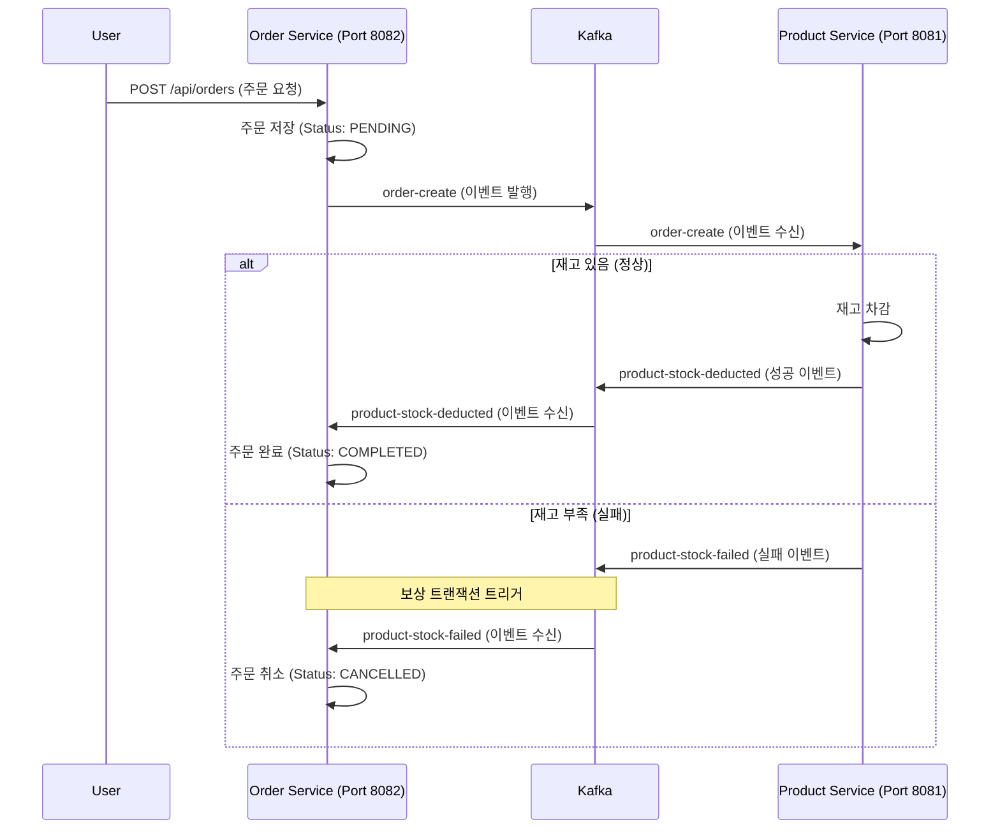

# MSA 기반 주문 및 재고 관리 시스템 (Saga 패턴 구현)

이 프로젝트는 Spring Boot, Kafka, MySQL을 사용하여 마이크로서비스 아키텍처(MSA) 환경에서 데이터 일관성을 유지하는 **Choreography 기반 Saga 패턴**의 동작 원리를 구현하고 검증한 예제입니다.

---

## 🏗 시스템 아키텍처 및 기술 스택

### 1. 서비스 구성 및 역할
- **Product Service (Port 8081)**:
    - 상품 정보 관리 및 실시간 재고 차감 로직 수행.
    - **RESTful API 제공**: 외부 클라이언트 및 타 서비스(`Order Service` 등)가 상품 정보를 조회하거나 관리할 수 있도록 다양한 엔드포인트를 노출합니다.
- **Order Service (Port 8082)**:
    - 주문 생성 및 전체적인 주문 상태 관리.
    - **REST Client 역할**: 필요 시 `Product Service`의 API를 호출하여 상품 정보를 확인하거나 검증하는 클라이언트 역할을 수행합니다.
- **Kafka**: 서비스 간 비동기 메시지 전달을 위한 메시지 브로커.
- **MySQL**: 각 서비스 전용 데이터베이스 (`product_db`, `order_db`).

### 2. 서비스 간 통신 방식
이 시스템은 효율적인 데이터 처리와 일관성 유지를 위해 두 가지 통신 방식을 혼용합니다.
- **동기 통신 (REST API)**: 데이터의 즉각적인 조회가 필요할 때 사용됩니다. `Product Service`는 API 서버로, `Order Service`는 클라이언트로 동작합니다.
- **비동기 통신 (Kafka)**: Saga 패턴(Choreography)을 통한 트랜잭션 처리에 사용되며, 서비스 간의 결합도를 낮추고 시스템의 가용성을 높입니다.

### 3. Saga 패턴 (Choreography) 흐름
이 시스템은 중앙의 제어자 없이 각 서비스가 이벤트를 주고받으며 로컬 트랜잭션을 처리하는 **Choreography 기반 Saga** 방식을 사용합니다.



1. **주문 접수**: 사용자가 `Order Service`에 주문 요청을 보냄 → 상태를 `PENDING`으로 저장.
2. **이벤트 발행**: `Order Service`가 Kafka의 `order-create` 토픽에 이벤트를 발행.
3. **재고 검증/차감**: `Product Service`가 이벤트를 수신 → 재고 확인 후 차감 성공 시 `product-stock-deducted` 발행 / 실패 시 `product-stock-failed` 발행.
4. **최종 상태 업데이트**: `Order Service`가 결과 이벤트를 수신하여 주문 상태를 `COMPLETED` 또는 `CANCELLED`로 업데이트 (보상 트랜잭션).

---

## 💡 보상 트랜잭션 (Compensating Transaction) 이란?

MSA 환경에서는 여러 서비스에 걸친 하나의 비즈니스 로직을 전통적인 ACID 트랜잭션(2PC 등)으로 묶기 어렵습니다. 대신, 각 서비스의 로컬 트랜잭션이 실패했을 때 **이전의 성공한 단계들을 되돌리는 로직**을 실행하여 결과적으로 데이터 일관성을 맞추는 기법이 바로 **보상 트랜잭션**입니다.

### 이 프로젝트의 보상 트랜잭션 구현 방식
1. **의미적 취소(Semantic Undo)**: 이 프로젝트에서는 이미 DB에 `PENDING`으로 저장된 주문을 물리적으로 `DELETE`하지 않고, `CANCELLED`라는 상태값으로 변경함으로써 논리적으로 취소 처리합니다.
2. **이벤트 기반 트리거**: `Product Service`에서 재고 부족 등의 이유로 로컬 트랜잭션이 실패하면 `product-stock-failed` 이벤트를 발행합니다.
3. **최종적 일관성(Eventual Consistency)**: 주문 생성 시점과 취소 시점 사이에 짧은 간극이 존재하지만, 결국에는 `Order Service`의 상태가 올바르게 업데이트되어 전체 시스템의 데이터 일관성이 유지됩니다.

---

## 🧪 테스트 시나리오 및 실제 검증 결과

모든 시나리오는 실제 로컬 환경에서 테스트되었으며, 다음과 같이 정상 동작함을 확인했습니다.

### 시나리오 1: 정상 주문 처리 (재고 충분)
- **과정**:
    1. 초기 재고 확인: `노트북(10개)`
    2. 주문 요청: `노트북 2개` 주문 (`POST /api/orders`)
- **결과**:
    - `Product Service`: 재고가 **10개 → 8개**로 차감됨.
    - `Order Service`: 주문 상태가 최종적으로 **`COMPLETED`**로 변경됨.

### 시나리오 2: 보상 트랜잭션 동작 (재고 부족)
- **과정**:
    1. 현재 재고 확인: `노트북(8개)`
    2. 주문 요청: `노트북 100개` 주문 (재고보다 많은 수량)
- **결과**:
    - `Product Service`: 재고 부족 예외 발생 → `product-stock-failed` 이벤트 발행. 재고는 **8개로 유지**.
    - `Order Service`: 실패 이벤트를 수신하여 이미 생성되었던 `PENDING` 주문을 **`CANCELLED`** 상태로 자동 변경. (데이터 일관성 보장 확인)

---

## 🛠 설치 및 실행 가이드

### 1. 인프라 실행 (Docker)
```bash
# 기존 데이터가 꼬였을 경우 볼륨까지 삭제 후 재시작 권장
docker-compose down -v
docker-compose up -d
```

### 2. 애플리케이션 실행
- `ProductServiceApplication` (8081) 실행
- `OrderServiceApplication` (8082) 실행

### 3. 주요 API 엔드포인트
- **상품 조회**: `GET http://localhost:8081/api/products`
- **주문 생성**: `POST http://localhost:8082/api/orders`
    ```json
    { "productId": 1, "quantity": 2 }
    ```
- **주문 목록**: `GET http://localhost:8082/api/orders`

---
